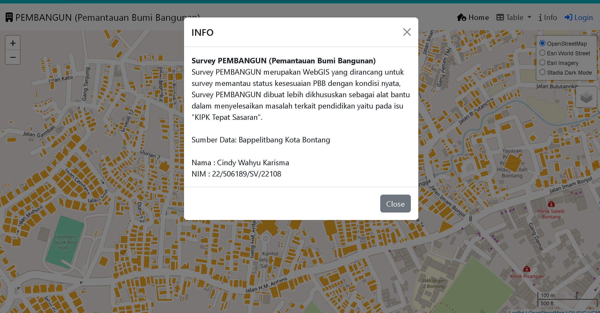

Responsi Pemrograman Web Lanjut

PEMBANGUN (Pemantauan Bumi Bangunan)
PEMBANGUN merupakan WebGIS yang dirancang untuk survey memantau status kesesuaian PBB dengan kondisi nyata,
PEMBANGUN dibuat lebih dikhususkan sebagai alat bantu dalam menyelesaikan masalah terkait pendidikan
yaitu pada isu "KIPK Tepat Sasaran". PEMBANGUN dirancang sebagai WebGIS Survey dalam update data dalam pengecekan kesesuaian antara kondisi nyata dengan PBB. 

Komponen Pembangun:
1. Laravel
2. Bootstrap
3. Font Awesome
4. Geoserver
5. QGIS
6. Postgres
7. Dbeaver

Sumber Data:
Data shapefile persil bidang tanah dari Bappelitbang Kota Bontang

Overview

